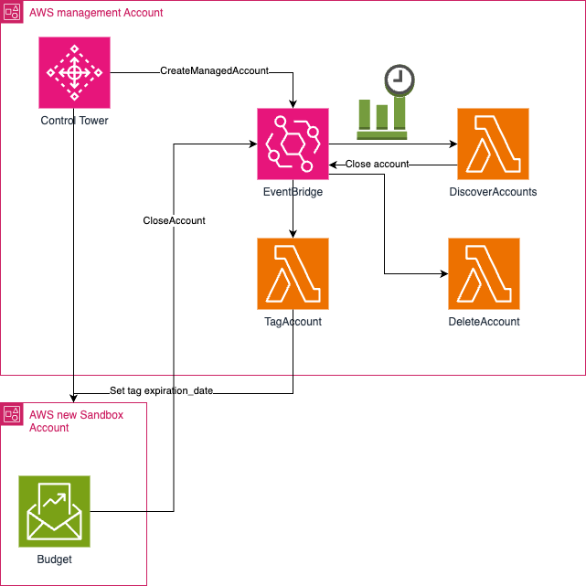

# Automate the set up and deletion of Sandbox account in Control Tower

This project configures the following: Sansbox template with expiration date tags. Deleting accounts with expired tags automatically.

## Architecture

## Prerequisites

- [Python 3](https://www.python.org/downloads/), installed
- [AWS Command Line Interface (AWS CLI)](https://docs.aws.amazon.com/cli/latest/userguide/install-cliv2.html) version 2, installed
- [AWS Serverless Application Model (SAM)](https://docs.aws.amazon.com/serverless-application-model/latest/developerguide/serverless-getting-started.html), installed

## Usage

#### Parameters
| Parameter                |  Type  |         Default          | Description                                                                                                                                     |
| ------------------------ | :----: | :----------------------: | ----------------------------------------------------------------------------------------------------------------------------------------------- |
| Sandbox OU name                  | String |        Sandbox      |                                                                         |
| parameter store location for expiration tag name        | String | expiration_date |/Control_Tower/expiration_date                             |
| parameter store location for expiration period (in months)       | String | 3 |/Control_Tower/account_expiration_period   |

